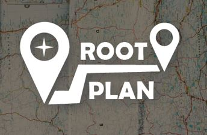
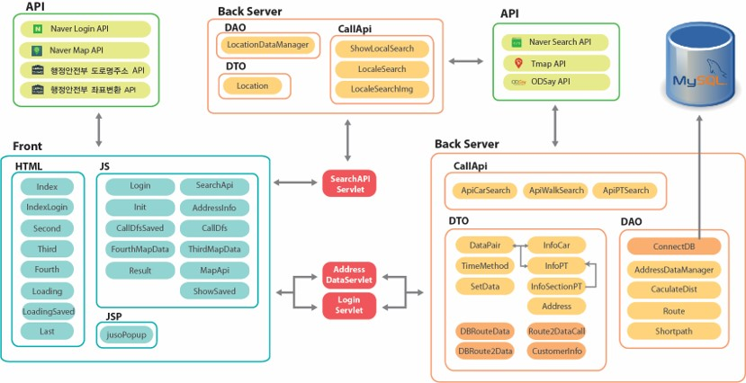
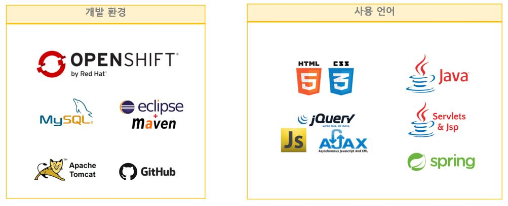

# 사용자 맞춤형 여행 Planner 루트플랜(RootPlan)

**Introduce**
-------------
루트 플랜은 사용자 맞춤형 여행 planner로 여행지 정보수집과 효율적인 여행 루트 설계를 도와 줌으로 써 여행 일정 동안의 불필요한 체력과 비용 그리고 시간이 소모되는 것을 방지해줍니다. 

 

**핵심 기능**
-------------
- 사용자가 원하는 여행지 선택 가능

- 지역 & 키워드 기반 여행 정보 제공

- 여행 경로 저장

- 사용자 맞춤 최적 경로(자동차+걷기 / 대중교통+걷기) 

 

**Architecture**
-------------
 

 

**시연영상**
-------------

1.5배속 메인 시뮬레이션 영상 : https://www.youtube.com/watch?v=pu89SWB-Cc4

테스트 1.3배속 + 자막: https://www.youtube.com/watch?v=ecFIpRGB-WM&t=20

대전 투어: https://www.youtube.com/watch?v=OR18It87Cl4

대구 투어: https://www.youtube.com/watch?v=rask-GUtt6g

홍성 투어: https://www.youtube.com/watch?v=3uBaBH-EqsM&t=37s

원주 + 창원 투어: https://youtu.be/9Gyr_axx6XQ

제주도 투어: https://www.youtube.com/watch?v=PilMn83SrO0

전라도 광주 투어: https://youtu.be/FtdQJJoNHW0

경상북도 안동 투어: https://youtu.be/ToyjyTGSPr4

전라북도 전주 투어: https://youtu.be/iyW_Cj-Hl8I

울산 투어: https://youtu.be/JhoYMeIObeg

전라도 여수 투어: https://youtu.be/OoBfzJfIbhc

 

**개발환경&언어**
-------------
 

